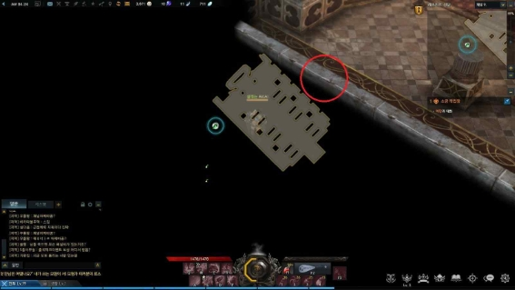
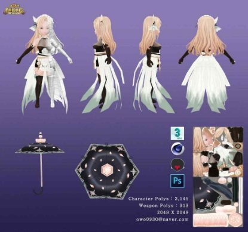
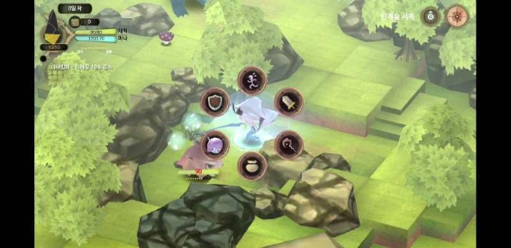
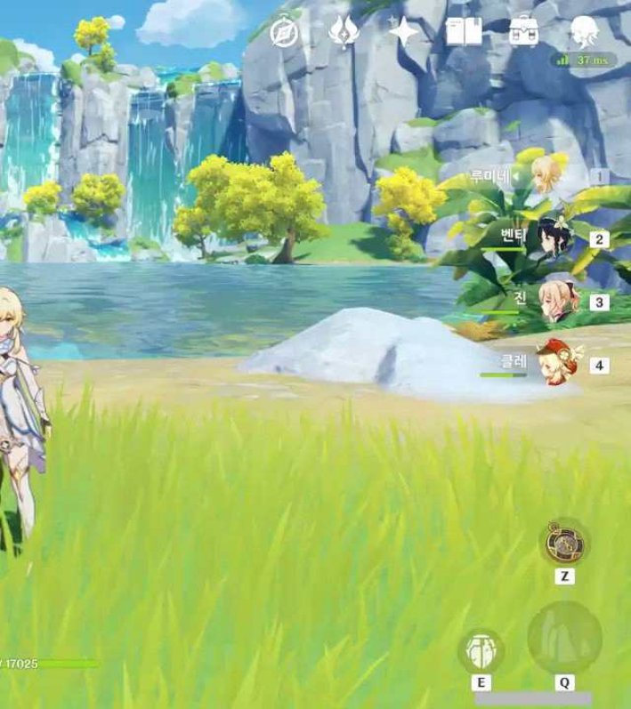
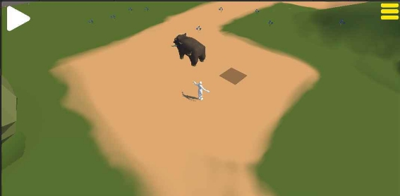
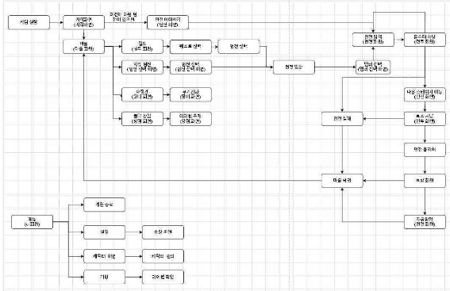
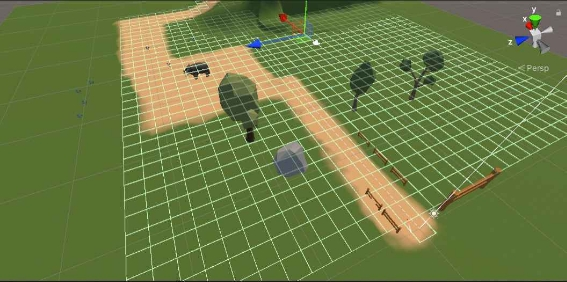

**제 목**

**목차>**

1. **게임 개요**
   1) **게임 제목**
   1) **플랫폼**
   1) **기획 의도**      
   1) **시점**
   1) **장르**
   1) **차별화 요소**
   1) **게임 조작법** 
   1) **클리어 조건**
   1) **주요 오브젝트**
1. **게임 소개**
   1) **시놉시스 및 세계관**
   1) **플레이 컨셉**
   1) **그래픽 컨셉**
   1) **사운드 컨셉**
   1) **UI/UX  컨셉**
1. **게임 컨텐츠**
   1) **컨텐츠**
   1) **엔딩**
1. **마무리**

`    `**1)기획 요약**

**Ⅰ. 게임 개요**

1) **게임 제목**
1) **플랫폼**
- 모바일

**2-1) 게임 엔진**

- 유니티
3) **기획 의도**

Ÿ 캐릭터성을  살린  전략  RPG  게임  제작

Ÿ 여러  수집  요소를  통한  보상으로  맵  탐험 Ÿ 다양한  던전을  통한  그래픽의  다양성

4) **시점**

Ÿ 3인칭  쿼터뷰

5) **장르**

Ÿ SRPG

6) **재미 요소**

Ÿ 던전 속 매번 다른 환경요소와 상성을 통한 다양한 전략 Ÿ 각  캐릭터만의  속성을  이용하여  환경요소  이용

Ÿ 각  던전마다의  수집품  및  환경의  다양성

Ÿ 몬스터마다의  특정  기믹  파훼

Ÿ 클리어  후  던전  난이도  상승

7) **게임 조작법**

Ÿ 칸 방식의 필드를 기반으로 몬스터와 전투에 들어가면 몬스터 와 플 레이어간의 턴교환으로 진행된다. 플레이어는 여러 캐릭터를 전략적으 로 배치하고 몬스터의 기믹과 환경요소를 이용하여 전투를 한다.

8) **클리어 조건**

Ÿ (전투) 몬스터의 체력이 0된다.

Ÿ (던전) 던전의 보스를 잡는다. 

Ÿ (의뢰 달성) 던전 탈출 및 자유 탐험

9) **주요 오브젝트**

Ÿ 각 던전에 맞는 환경요소 및 몬스터 Ÿ 숨겨진 보물상자

Ÿ 수집 요소

Ÿ 다음 단계로 이동으로 이동할 수 있게 하는 트리거(아이템)

**Ⅱ. 게임 소개**

1) **시놉시스 및 세계관**

배경은  하늘섬  리멘,  밑에  유적이  있습니다.

유적(던전)에서  파밍을  통해  생계를  유지합니다.

하늘섬은  다른  곳에서도  여러  개  존재합니다.

하늘섬  마다  지형적인  특색이  존재합니다.  (화산,  기계) 제작하는건  첫  번째  하늘섬만  해당합니다.

원소  속성별  전투를  사용합니다.  (원신  전투  방식)

모험가  이제  막  탐험을  하려는  느낌으로  시작합니다.  (튜토리얼) 길드에 가입되어 유적(던전)  탐험을 계속 하던 주인공은 어느 날, 자신의 

집  창고에서  오래된  책  한권을  발견했습니다. 

책에서는 전설로만 알고 있었던 [코어]에  관한 내용이 상세하게 기록되어 있었습니다. 

흥미가 생긴 주인공은 자신이 살고 있는 하늘섬의 유적에 잠들어 있는 [코 어]를  찾기  위해  유적의  가장  최하층으로  나아가기로  합니다. 주인공의  최종목적은  책에  적힌  모든  코어를  찾는  것 

튜토리얼  흐름

길드  의뢰를  진행하는  과정,  튜토리얼 1.  이동,  전투  방식  설명 <리멘  유적  1,  2층> 

1. 유적  전갈,  유적  뉴트리아
1. 길드  의뢰  수행

<유적  3층>

1. 유적  뱀
1. 새로운  동료  만남

<유적  4층>

1. 유적  골렘의  조각
1. 버섯  몬스터
3. 의뢰  달성   스토리  진행을  위해  캐릭터들  대화  후  아래층으로  이동 <유적  5층>
1. 작은  골렘  (중간보스1,  속성:  풀,  공략:  각  파츠를  분리  후  파괴,

이  골렘의  경우  7층부터는  잡몹으로  등장)

2. 마을  복귀

지상의  블루홀이라고  불린다.  위험한  걸  알면서도  아름다운  재화와  보상에 눈이 멀어 던전 깊숙한 곳까지 들어갔다가 빠져 죽는다는 의미로... (어려움 난이도의 디버프 이유)

2) **플레이 컨셉**

Ÿ 캐릭터성과  환경요소를  이용한  전략  구성 Ÿ 몬스터의  기믹을  이용한  전투

Ÿ 던전  공략으로  캐릭터  성장,  수집

3) **그래픽 컨셉**

Ÿ 3D,  카툰렌더,  혼합  판타지

Ÿ 캐릭터  그래픽  (이미지  참고)

4) **UI/UX  컨셉**

메인 인터페이스

4-1) ui 아이콘

픽토그램 (원신) Ÿ

**Ⅲ. 게임 컨텐츠**

**1) 컨텐츠**

Ÿ 던전  탐험

Ÿ 수집품  수집

Ÿ 수집품을  이용한  캐릭터  수집

**Ⅳ. 마무리**

**1)기획 요약**

Ÿ 캐릭터(상성)와  환경요소를  이용한  SRPG

Ÿ 퀘스트와  던전  탐험  방식을  이용한  수집  및  던전  클리어

\----------------------------------------------------------------------------------------

- 목표를  달성하기  위한  세부  기능 
  - 그래픽  화면의  구성  (최소  콘티  화면에서  그래픽  화면까지  가능)

캐릭터  이동시에는  이동  목표칸  표시

좌측상단  아이콘:  카메라  회전  버튼으로  사용예정

우측상단  아이콘:   던전UI  (탈출,설정,게임종료) 

- 프로그램 개발 기능: 프로그램 기능 블록 및  그래픽 요소와의 관계

칸방식을  이용한  캐릭터  이동  및  전투

이동 가능한 칸과 이동 불가능한 칸을 이용한  숨겨진 보물상자 획득(숨겨 진  길)

카메라  회전을  통한  시점변환

환경요소마다의  속성(불<물,  물<얼음)

- 불장판을  물공격으로  지움
  - 게임이라면 개임적인 요소(게임 밸런스 요소, 다른 게임에 비해 차

별점,  스태이지  등  고려할  것)

Ÿ 캐릭터  최대  4명을  이용

Ÿ 던전환경에  맞는  캐릭터  사용  미사용으로  전투  난이도  상승  또는  하락 Ÿ 환경요소를  이용  또는  파훼

Ÿ 무지성  공격이  아닌  몬스터의  기믹  활용

Ÿ 반복되는  전투로  인한  지루함을  없애기위한  환경요소  랜덤배치

Ÿ 레벨업  이후  레벨에  맞는  던전  난이도

Ÿ 던전  속성  또는  난이도에  맞는  수집품 

- 개발  일정  (개인  별  업무와  일정,  9주  이후  매  주  통합  내용) 

|내용|담당자|기간(주차) 4.14~6.07|비고|
| - | - | - | - |
|||3|4|5|6|7|8|9|10|11|12|13|14||
그래픽의  경우  먼저  끝나거나  담당인원이  어려워하는  경우  여유가 되는  인원이  지원하는  방식

|캐릭터  디자인|차지원||||||||||||||
| - | - | :- | :- | :- | :- | :- | :- | :- | :- | :- | :- | :- | :- | :- |
|주인공  캐릭터 디자인|||||||||||||||
|A캐릭터 디자인|||||||||||||||
|케릭터  모델링|차지원||||||||||||||
|주인곤  캐릭터 모델링|||||||||||||||
|A캐릭터 모델링|||||||||||||||

|배경  디자인|김나정||||||||||||||
| - | - | :- | :- | :- | :- | :- | :- | :- | :- | :- | :- | :- | :- | :- |
|던전  타일 디자인|||||||||||||||
|소품  모델링|||||||||||||||
|배경  모델링|김나정||||||||||||||
|던전  타일 모델링|||||||||||||||

|칸  방식  맵 프로그래밍|박성찬||||||||||||||
| - | - | :- | :- | :- | :- | :- | :- | :- | :- | :- | :- | :- | :- | :- |
|턴  방식  전투 구현|박성찬||||||||||||||
|몬스터  AI 프로그래밍|박성찬||||||||||||||
|스킬 프로그래밍 |박성찬||||||||||||||
|장비  강화 구현|박성찬||||||||||||||
|ui  기능|박성찬||||||||||||||
|
몬스터  패턴 

디자인
|박성찬||||||||||||||

|몬스터 디자인|윤완호||||||||||||||
| - | - | :- | :- | :- | :- | :- | :- | :- | :- | :- | :- | :- | :- | :- |
|잡몹1~4 디자인|||||||||||||||
|유적  잡몹 골렘  디자인|||||||||||||||
|10층  중간 보스  디자인|||||||||||||||
|몬스터  모델링|윤완호||||||||||||||
|잡몹1~4 모델링|||||||||||||||
|유적  자몹 골렘  모델링|||||||||||||||
|10층  중간 보스  모델링|||||||||||||||

|게임  기획 스토리|전체||||||||||||||
| :-: | - | :- | :- | :- | :- | :- | :- | :- | :- | :- | :- | :- | :- | :- |
|`  `리깅|전체|||||||||||||가 능 한  선 에 서 작업|
|ui  디자인|전체||||||||||||||
|합|전체||||||||||||||

|내용|담당자|기간(주차) 4.14~6.07|비고|
| - | - | - | - |
|||3|4|5|6|7|8|9|10|11|12|13|14||
|게임  기획 스토리|전체||||||||||||||
|칸  방식  맵 프로그래밍|박성찬||||||||||||||
|턴  방식  전투 구현|박성찬||||||||||||||
|몬스터  AI 프로그래밍|박성찬||||||||||||||
|스킬 프로그래밍 |박성찬||||||||||||||
|장비  강화 구현|박성찬||||||||||||||
|
몬스터  패턴 

디자인
|박성찬||||||||||||||
|캐릭터  디자인|차지원||||||||||||||
|몬스터 디자인|윤완호||||||||||||||
|배경  디자인|김나정||||||||||||||
|ui  기능|박성찬||||||||||||||
|ui  디자인|전체||||||||||||||
|케릭터  모델링|차지원||||||||||||||
|배경  모델링|김나정||||||||||||||
|몬스터  모델링|윤완호||||||||||||||
|`  `리깅|전체|||||||||||||가 능 한  선 에 서 작업|
|합|전체||||||||||||||
- 예상되는  어려움

Ÿ 스토리

Ÿ 캐릭터  및  몬스터의  리깅  (모션)

Ÿ 다양한  몬스터  디자인

Ÿ 각  환경의  개성  디자인

Ÿ 칸방식  전투와  여러  가지  환경  요소의  랜덤한  생성,  이동  알고리즘  등

- github  master  링크 

https://github.com/mwmpms/project\_srpg

몬스터  정리

유적  전갈

속성:  풀

특징:  사람  무릎높이정도  크기,  큰  집게,  다리  2쌍,  거미입,  등쪽의  이끼 색상: 초록색(이끼 색),  검붉은색(껍질),  연한갈색(관전 사이사이 포인트), 붉은색(꼬리  침)

사냥 방법이 숨어있다 잡는 방법이다보니 등에 이끼가 껴있다. 큰  집게는 한번  잡은  사냥감을  놓지  않기  위해  크게  진화  하였고  잡은  사냥감을  꼬 리에 있는 독을 이용해 마비를 시킨다. 전갈에서 나오는 미량의 독은 오히

려  좋은  약이라고  한다.

유적  쥐

속성:  불

특징:   사람 무릎높이정도 크기, 큰  앞니, 뉴트리아같은 이미지, 두더지 같 은  손(땅파기)

색상: 갈색(몸  배이스),  초록색(이끼 색),  검은색(다리),  회색(몸통과 다리 사이)

설명: 새끼일때는 몸전체가 회색이지만 점차 성장함에 따리 발부분이 검은 색으로 변하면서 등쪽은 갈색털로 덮히기 시작한다. 오래살은 놈은 몸  전 체가 갈색이라도 한다. 이가 매우 단단하여 삽  앞부분으로 쓰는 경우도 있

다고한다.

유적  뱀

약점  속성:  불

특징:  기본적인  뱀  형태, 스프링을  연상하게  하는  꼬리  말림,  기어다니지 않고  꼬리의  힘을  이용해  점프  하는  방식으로  이동함

색상:  연한  갈색과  유적과  비슷한  색(두  색을  혼합) 

설명:  고기를  가져가  뱀구이를  해먹으면  별미라고한다.

유적  버섯

약점  속성:  불

특징:  사람만한  크기,  팔다리가  달려있다,  송이  버섯  참고,  머리가  2개인 버섯도  존재

색상:  초록색,  빨강색(머리부분),  희색에서  먼지있는  색(몸통  전체) 설명:  탐험가에게는  비상식량으로  먹을  수  있을  정도로  영양가가  높다.

유적  골렘  조각 골렘의  손가락  부분

유적  골렘

약점  속성:  불

특징:  사람 허리 높이 사이즈, 방패를 들고 있다, 유적 관련 문양, 나무로 각  파츠가  합쳐져있음

색상:  유적과  동일한  색상

설명: 유적 벽에 세워져있는 골렘 장식같아 움직일거라고는 생각도 못하고 있다.

5층  스토리 골렘: 원래는 있으면 안되는 곳에 있는 골렘이다. 주인공이 유 적에  대한  호기심  유발  장치

출쳐

그림1 https://lostark.game.onstove.com/Library/Tip/Views/101339?page=1&libraryStatusType=0&librarySearchCategory =0&searchtype=4&searchtext=AkiAi&ordertype=latest&LibraryQaAnswerType=None&UserPageType=1 그림2

https://static.inven.co.kr/column/2017/07/14/news/i13127465916.png

그림4

https://m.post.naver.com/viewer/postView.naver?volumeNo=16329174&memberNo=36978476#

그림5 https://www.google.com/url?sa=i&url=http%3A%2F%2Fm.blog.naver.com%2Fyeonju23%2F221129019409&p sig=AOvVaw3A4tUBaHk4ezakvH1je8Or&ust=1664103035769000&source=images&cd=vfe&ved=0CAwQjRxqFwo TCOjCl\_6grfoCFQAAAAAdAAAAABAD
\-  18  -
